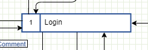
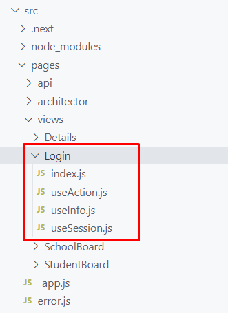
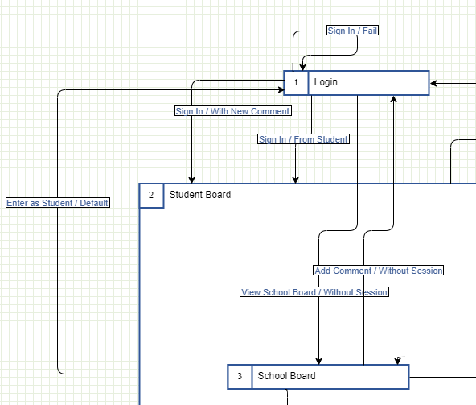
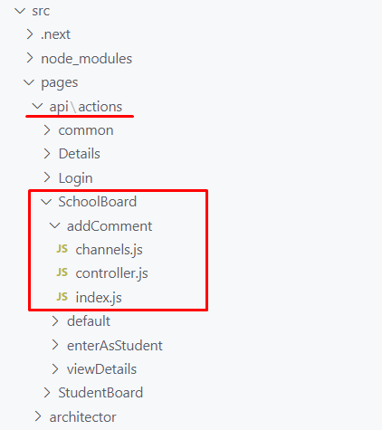

# School Board Project - Arquitectura

## Introducción

Un **UITD** contiene *Vistas* (referidas en el código como **Views** o también nombradas como *Interfaces*) y *Transiciones* (referidas en el código como **Actions**), cada *Vista* especifíca un nombre y un *identificador*. Las *Transiciones* cuentan con un nombre bajo la convención *Nombre / Canal*, dónde el *Canal* opcional indicaun *condición* para que una misma *Acción* pueda tener múltiples *Transiciones* hacía diferentes *Vistas* (piense en una *Vista de Inicio de Sesión* que bajo la misma *acción* de iniciar sesión podría llevar a múltiples *vistas*).

La arquitectura está separada en dos carpetas `src/pages/api` y `src/pages/views`. El cliente es ejecutado en el navegador y los recursos son locales en el equipo del usuario. El servidor es ejecutado en un equipo común a todos los clientes.

## Arquitectura Lado Cliente

Todos los códigos generados del cliente se encuentran bajo `src/pages/views`.

### Vistas

Una vista es representada en el editor por una caja nombrada, la cuál contiene en su esquina superior derecha un identificador y a un lado el nombre fijado que puede ser editado con doble clic.

> Ejemplo de una vista diseñada en el diagrama, dentro del editor



Cuándo se genera el código del proyecto, cada vista es dispuesta en una carpeta dentro de `src/pages/views`, por ejemplo, si la vista se llama `Login`, su código generado quedará en la carpeta `src/pages/views/Login`.

> Ejemplo de los archivos generados para la vista `Login`



Cada vista genera 4 archivos dentro de la carpeta común:

* `index.js` - Contiene el **componente** de React principal de la vista
* `useAction.js` - Contiene un **hook** de React que devuelve un objeto con las funciones registradas a las que tiene acceso la vista (cada acción es una transición marcada en el diagrama).
* `useInfo.js` - Contiene un  **hook** de React que devuelve un objeto con toda la información relacionada al diagrama, como la ruta del diagrama, el nombre original de la vista, el nombre corregido, las acciones listadas, etc.
* `useSession.js` - Contiene un **hook** de React que devuelve un arreglo con los datos devueltos por el servidor cuándo se realiza una transición (el resultado de la transición a esa vista), el identificador de la sesión (el identificador único de la transición hacia esa vista) y los datos de transición (un objeto con la información de la vista desde donde se originó la transición, el nombre de la transición, el canal usado y demás información relacionada).

El código de `index.js` autogenerado de una vista es similar al siguiente. Este sólo se generará si el archivo no existe (no se reemplaza en futuras actualizaciones).

> Ejemplo de `Login/index.js` generado la primera vez

```js
import React from "react";

import Prefab from "../../architector/react/Prefab";

import useAction from "./useAction";
import useInfo from "./useInfo";
import useSession from "./useSession";

// Has not subviews

export default function Login() {
    const info = useInfo();

    const [result, session] = useSession();

    const { getActionByName } = useAction();

    return (
        <Prefab info={info} getActionByName={getActionByName}>
            {JSON.stringify([result, session])}
            <hr />
            <div style={{ padding: "64px", border: "1px solid gainsboro" }}>
                {/* Has not subviews */}
            </div>
        </Prefab>
    );
}
```

Podemos observar los siguientes fragmentos de código.

* `import React from "react";` - Importa las liberías para utilizar vistas de React.
* `import Prefab from "../../architector/react/Prefab";` - Importa un componente llamado `Prefab` el cuál mostrará una guía para los programadores, con la información de su vista.
* `import useAction from "./useAction";` importa el hook de React expuesto en el archivo `useAction.js`.
* `import useAction from "./useInfo";` importa el hook de React expuesto en el archivo `useInfo.js`.
* `import useAction from "./useSession";` importa el hook de React expuesto en el archivo `useSession.js`.
* `// Has not subviews` - En caso de que el componente tenga vistas anidadas, importará cada vista.
* `export default function Login() {` - Define la función principal del componente y la exporta por defecto, para que la carpeta `Login` pueda ser utilizada como el componente `<Login />`.
* `const info = useInfo();` - Usa el hook `useInfo` y obtiene el objeto con la información del diagrama, este lo puede usar el programador para automatizar algún código o mostrar información relevante.
* `const [result, session] = useSession();` - Usa el hook `useSession` y obtiene el resultado devuelto por el servidor y el identificador de la sesión. El resultado `result` puede ser cualquier valor que pueda ser contenido en un `JSON` o `null`, por ejemplo, un número, un texto, un valor lógico (booleano), un objeto, un arreglo o un valor nulo.
* `const { getActionByName } = useAction();` - Usa el hook `useAction` el cuál devuelve un objeto con las funciones registradas para realizar cada acción, por ejemplo, si en diagrama se registra la acción `signIn`, se podrá obtener mediante `const { signIn } = useAction();`.
* `return (...);` - Devuelve la vista principal de la pantalla. Por defecto se devuelve una vistra prefabricada que usa el componente `<Prefab />` y la información de la vista.

### Acciones y Transiciones

Las acciones a nivel diagrama son representadas como flechas dirigidas entre vistas, las cuales poseen un nombre bajo la convención `NOMBRE / CONDICIÓN`, dónde la **condición** es el nombre de un **canal** para hacer la **transición**.

> Ejemplo de un diagrama con 3 vistas visibles (`Login`, `Student Board` y `School Board`). Se aprecian distintas acciones como `Sign In`, `Add Comment`, `Enter as Student`, etc.



Cada acción representa una transición hacia diferentes vistas según las distintas condiciones. Por ejemplo, la acción `Sign In` puede dirigirse a la vista `Student Board` bajo dos condiciones, la primera acción `Sign In / With New Comment` indicará que la transición se hará de la vista `Login` a la vista `Student Board` bajo datos relacionados con la condición `With New Comment`. La segunda acción `Sign In / From Student` indicará que la transición se hará de la vista `Login` a la vista `Studen Board` con los datos bajo la condición `From Student`.


En el código sólo será registrada una acción (`Sign In`). Del lado de la vista (en el lado del cliente), se podrá consumir la acción como una función asíncrona mediante el hook `useAction`.

> Ejemplo del consumo de la acción `Sign In` en la vista `Login`.

```js
// Recuperamos la función `signIn` del hook `useAction`
// Esta función pertenece a la acción `Login/signIn`
// Observa la nomenclatura "Sign In" -> "signIn" (formato camelCase).
const { signIn } = useAction()

// Controlamos el evento del botón al dar clic sobre él
// Llamamos a la función `signIn` con los datos enviados al servidor
// La función `signIn` llamará al API `api/actions/Login/signIn`
const onClickButtonHandler = event => {
    signIn({ username: "foo", password: "bar" })
}

// Devolvemos la interfaz adecuada con un botón que al darle clic
// ejecute el controlador definido arriba, y así invocar la acción
return (
    ...
    <button onClick={onClickButtonHandler}>Iniciar Sesión</button>
    ...
)
```

Al ejecutar una acción, la vista (del lado del cliente) llamará al API correspondiente a la acción (del lado del server). El servidor realizará las operaciones correspondientes para determinar qué condición de transición se cumple, y devolverá el resultado de la ejecución y la transición correspondiente. Por ejemplo, al recibir los datos de inicio de sesión, determinará si se inicia sesión con o sin comentario adjunto.

### Sesiones

Cada que una acción es completada se realiza una transición automática entre las vistas. El API genera un resultado de la operación de ejecutar la acción solicitada y determinar la condición. El resultado de dicha operación es consultado de forma asíncrona mediante una petición al caché del servidor.

Es decir, cuándo una acción es ejecutada se crea una **Sesión**, esta sesión identifica el resultado de lanzar la acción al serividor y los datos de la transición.

El resultado de una transición y los datos de la sesión pueden ser consultados usando el hook `useSession`.

> Ejemplo del acceso al resultado de una transición en la vista `StudentBoard`.

```js
// Recuperamos el resultado de la sesión
// el identificador único de la sesión
// y la información de la sesión
const [result, sessionId, sessionInfo] = useSession();

// El resultado podría ser `null` si aún no está listo
if (!result) {
    // Podemos regresar otra vista sabiendo que aún no hay resultado
    return <span>Esperando el resultado...</span>
}

// Podemos recuperar los datos del servidor enviados como resultado
// por ejemplo, si el servidor responde con el nombre de usuario,
// con su foto de perfil, la lista de amigos, etc.
return <h1>Bienvenido {result.username}</h1>
```

En el caso particular que una acción resulte en la misma vista, por ejemplo, una acción que vaya de la vista `Student Board` a la vista `Student Board`, entonces habrá que detectar si la sesión ya cambió usando un efecto mediante el hook `useEffect`.

> Ejemplo de la detección de cambios en la sesión

```js
const [result, sessionId] = useSession()

useEffect(() => {
    // La sesión cambió, actualiza el estado del componente
    // Ejemplo, comprobamos si hay resultado
    if (result) {
        // Si el resultado tiene un commentario asociado
        if (result.comment) {
            // Abrimos el modal para mostrar el comentario y publicarlo
            setOpenModal(true)
        }
    }
}, [sessionId, result])
```

## Arquitectura Lado Servidor

Todos los códigos generados del servidor se encuentran bajo `src/pages/api`.

### Controladores de Acciones (API)

Del lado del servidor, cada acción será colocada en una carpeta bajo la ruta `src/pages/api/actions/<VISTA>/<ACCIÓN>`, donde la `<VISTA>` es el nombre ajustado para la vista y `<ACCIÓN>` es el nombre ajustado para la acción.

Por ejemplo, para la vista `School Board`, su nombre ajustado será `SchoolBoard`, siguiendo el formato `PascalCase` y para la acción `Sign In` el nombre ajustado será `signIn`, usando el formato `camelCase`. Así para esa acción se creará la carpeta `src/pages/api/actions/SchoolBoard/signIn`.



Cada carpeta de acción contiene 3 archivos:

* `index.js` - Es el archivo principal que contiene el código del servidor que procesará la acción. Por ejemplo, aquí se accederá a la base de datos, se determinará que canal de salida producir y los datos de resultado que se pasarán a la vista.
* `controller.js` - Contiene la función encargada de procesar la entrada y salida definida como `createActionController`. Esta función recibe la entrada del usuario y devuelve un canal de los registrados con el resultado.
* `channels.js` - Contiene el registro de los canales disponibles para ser devueltos, también funciones de apoyo para regresar canales aleatorios o de error.

El archivo `index.js` generado por defecto luce del siguiente modo.

> Ejemplo del archivo `index.js` generado.

```js
const { createActionController } = require("./controller");

const { 
    goError, 
    goRandom,
    goLoginByDefault
} = require("./channels");

module.exports = createActionController(input => {
    if (input === "test error") {
        return goError("<Write your custom error>");
    }
    
    if (input === "test Login") {
        return goLoginByDefault("<put your result data, example some object instead this string>");
    }
    
    return goRandom("<put your result data, example some object instead this string>");
});
```

Podemos observar los siguientes fragmentos de código.

* `const { createActionController } = require("./controller")` - Recupera la función principal para crear un controlador de acciones desde el archivo `controller.js`. Esta función toma un callback que expone la entrada del usuario `input` y devuelve el canal de resultado, por ejemplo `goLoginByDefaul(result)`.
* `const { goLoginByDefault, goError, goRandom } = require("./channels")` - Recupera las funciones ensambladoras del resultado. Cada canal es dispuesto como una función `go<Vista>By<Canal>`, donde `<Vista>` es el nombre de la vista a la que se dirigirá (según la transición marcada en el diagrama) y `<Canal>` es el nombre de la condición puesta en el diagrama después del nombre de la acción. Por ejemplo, si en el diagrama se establece la acción `Sign In / With Comment` de la vista `Login` a `Student Board`, entonces dentro de la acción `Login/SignIn` estará marcado el canal `goStudentBoardByWithComment`.
* `module.exports = createActionController(input => { ... })` - Se crea un controlador (un API de Next JS) que toma los datos de entrada de la vista y devuelve el canal y resultado como salida (por defecto `return goRandom()`).
* `return goLoginByDefault(result)` - Devuelve el resultado `result` a la vista `Login` en el canal `Default`. El resultado debe poder ser contenido en un JSON.
