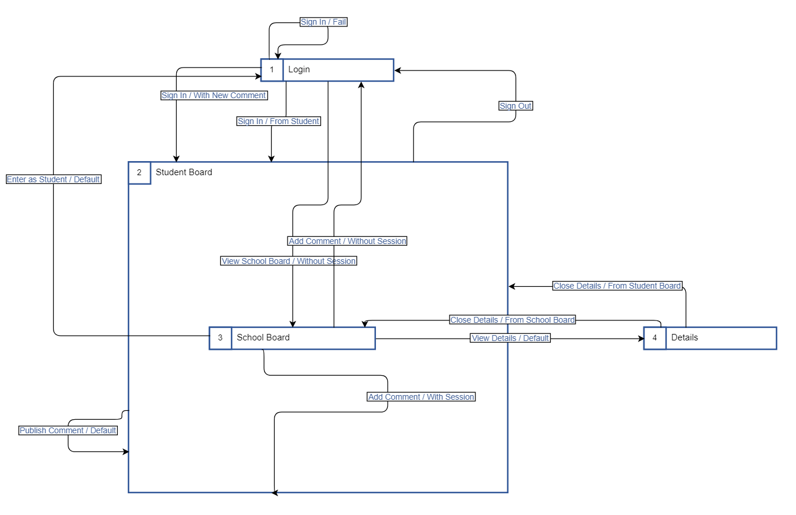
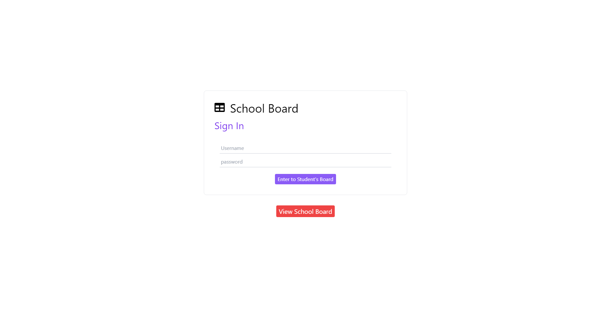

# School Board Project - Vistas

## Introducción

El proyecto se compone de 4 vistas:

* `Login` - Página de inicio de sesión.
* `Student Board` - Pantalla de inicio del estudiante.
* `School Board` - Página de comentarios de los estudiantes.
* `Details` - Página de detalles de un comentario.

## View: Login

En esta interfaz el usuario puede ingresar sus credenciales y dirigirse a la interfaz de `Student Board` o dirigirse directamente a `School Board` a través de pulsar el botón `View School Board`.

### Acciones

En la siguiente tabla se listan las acciones de la interfaz `Login`.

Acción | Condición | Vista Inicial | Vista Final | Descripción
--- | --- | --- | --- | ---
`Sign In` | `Fail` | `Login` | `Login` | Indica que no se pudo iniciar sesión.
`Sign In` | `From Student` | `Login` | `Student Board` | Inicia sesión con credenciales.
`Sign In` | `With Comment` | `Login` | `Student Board` | Inicia sesión con credenciales y el comentario adjunto.
`View School Board` | `Without Session` | `Login` | `School Board` | Se dirige a la interfaz de los comentarios sin el tablero del usuario.

En la siguiente tabla se muestran los nombres ajustados en código.

Nombre Original | Nombre en Código | Tipo | Formato
--- | --- | --- |  ---
`Sign In` | `singIn` | `Acción` | `camelCase`
`Fail` | `Fail` | `Condición` | `PascalCase`
`From Student` | `FromStudent` | `Condición` | `PascalCase`
`With Comment` | `WithComment` | `Condición` | `PascalCase`
`View School Board` | `viewSchoolBoard` | `Acción` | `camelCase`
`Without Session` | `withoutSession` | `Condición` | `PascalCase`
`Login` | `Login` | `Vista` | `PascalCase`
`Student Board` | `StudentBoard` | `Vista` | `PascalCase`
