# Introduction to Architector Pro

By [Dragon Nomada](dragonnomada.medium.com)

## What is Architector Pro?

A framework develop by [UAM-C Researchers & Students](https://www.sciencedirect.com/science/article/abs/pii/S0164121213001003) based on Diagram Editor for generating React JS + Next JS projects.

> Visit [https://architector.org](https://148.206.168.145/EditorUITD/examples/indexF.html)

## Introduction

**Architector Pro** allows to generate a [Next JS](https://nextjs.org) project based on a [UITD](https://www.sciencedirect.com/science/article/abs/pii/S0164121213001003) (User Interface Transition Diagram).

The *UI Transition Diagram* defines User Interfaces and Transitions amoung them.

> Example UITD

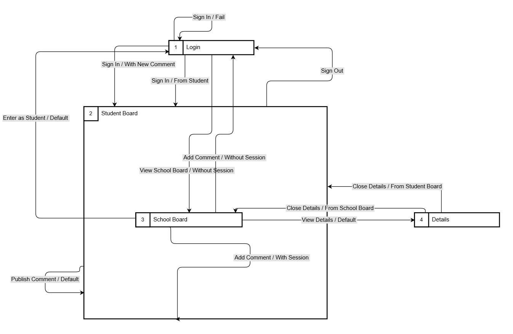

You can edit the diagram by the Architector Editor.

> Example Architector Pro Editor

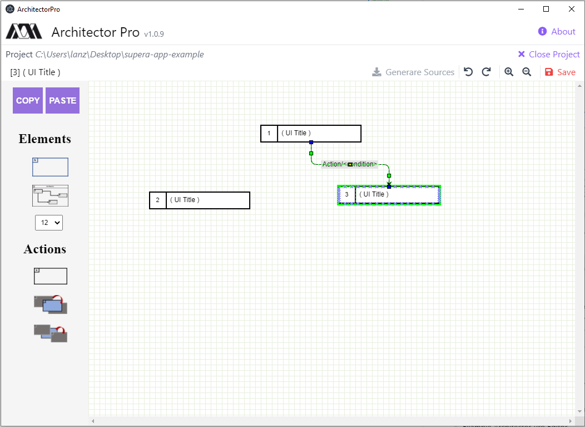

## Tutorial

Follow the next steps to create a new Architector Pro project.

> 1. Install Architector Pro binary

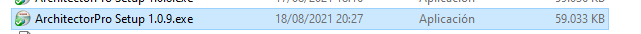

> 2. Open the Architecto Pro application

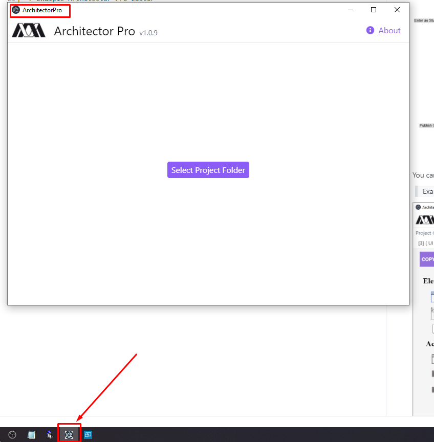

> 3. Select a folder (the project folder)

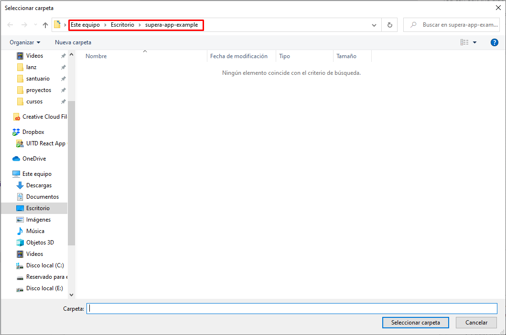

> 4. Design your UIs and Transitions

* **Note:** Don't forget to save it.

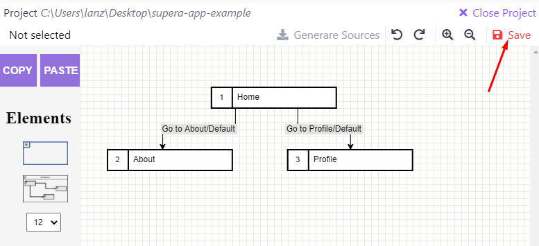

> 5. Generate the source code of the project

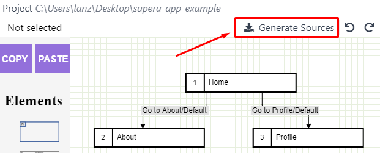

> 6. Check the project folder by clicking in the path

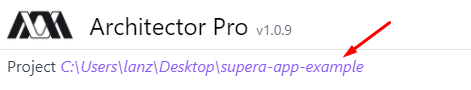

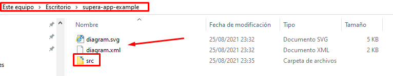

> 7. Open the `src` folder in [Visual Code](https://code.visualstudio.com)

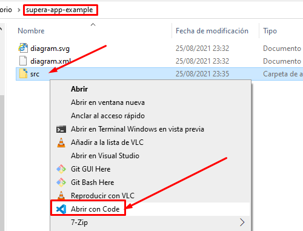

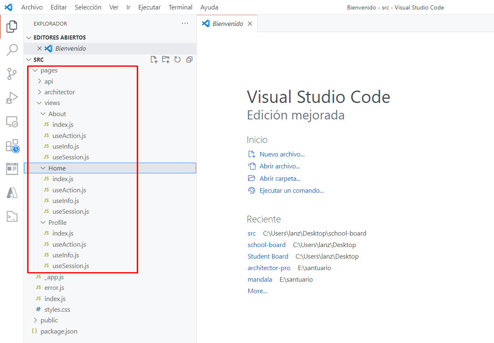

> 8. Open the terminal with `CTRL+J` and install the Node JS dependencies

```bash
npm install
```

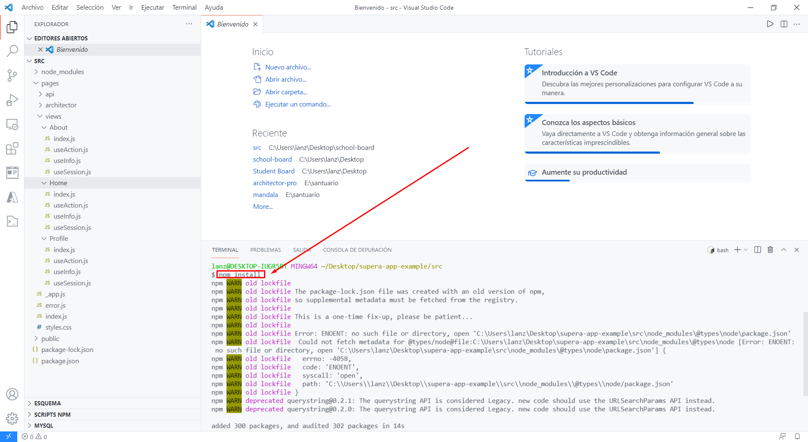

> 9. Run the project

```bash
npm run dev

--- alternative ---

npx next dev
```

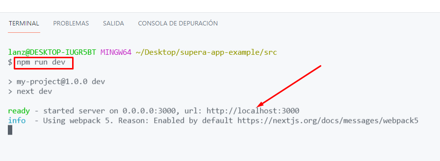

> 10. Visit [http://localhost:3000](http://localhost:3000)

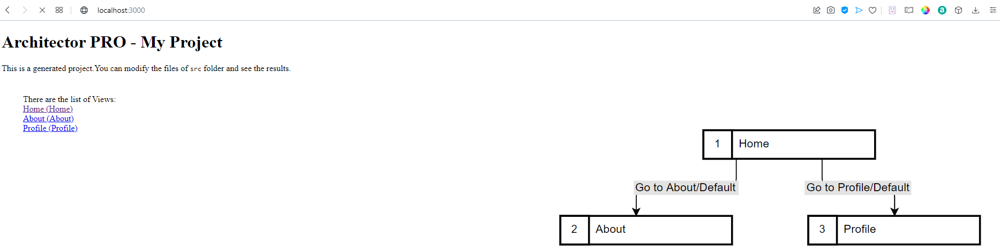

## What next?

Now you can follow the [School Board Tutorial](./Tutorial.md) to learn to make an awesome project.
