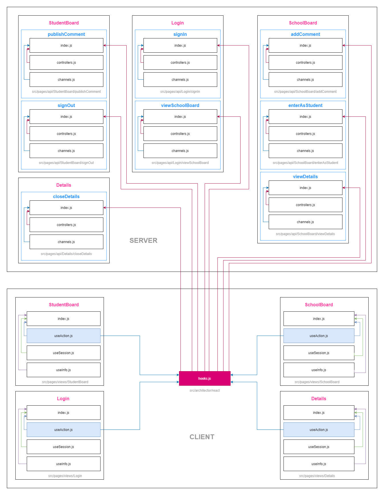

# School Board Project - Sowftware Architecture

## Introduction

In the next document you can undestand by diagrams and explanations the *Project's Sowftware Architecture*.

## Transition File Dependency Diagram

> Shows the transition process and the files involved



### `SERVER` Side

* Each pink box represents a `UI`.
* Each blue box represents a `Action`.
* The `index.js` contains the main `Action Controller`.
* The `controllers.js` contains the library to handle the API's requests.
* The `channels.js` contains the conditions defined for each *action* and one method called *the-go-method* to `<action>/<condition>` transition into the diagram.

### `CLIENT` Side

* Each pink box represents a `UI`.
* The `index.js` contains the main React Component for the `UI`.
* The `useActions.js` contains the `useAction()` React's Hook and the list of the `UI` actions.
* The `useSession.js` contains the `useSession()` React's Hook and the *result* of the transition.
* The `useInfo.js` contains the `useInfo()` React's Hook and the *info* of the `UI` and its actions.
* The `hooks.js` contains the `useCommonAction()` React's Hook. This *hook* make the **action-functions**, send the data to the *API* (`SERVER` Side) and fetch the new *transition session* (`CLIENT` side).

## The Transition Process

> Step 1. Into `CLIENT: SomeUI/index.js` - Call some action with data

```jsx
// pages/views/SomeUI/index.js

const { someAction } = useAction()

return (
    <button onClick={() => someAction(data)}>Do Some Action</button>
)
```

> Step 2. Into `CLIENT: hooks.js` - Send the data to the API and await for the result

```jsx
const response = await fetch(`/api/actions/${name}`, {
    method: "post",
    headers: { "Content-Type": "application/JSON" },
    body: JSON.stringify(data)
});
```

> Step 3. Into `SERVER: api/actions/SomeUI/someAction/index.js` - Handle the input data and make transition with some condition and result

```js
module.exports = createActionController(data => {
    // TODO: Process the data (maybe use database)

    return goOtherUIBySomeCondition(result);
});
```

> Step 4. Into `SERVER: api/actions/SomeUI/someAction/channels.js` - Get the `<action>/<condition>` protocol

```js
goOtherUIBySomeCondition(result) {
    return {
        channel: "SomeCondition",
        target: "OtherUI",
        result
    }
},
```

> Step 5. Into `SERVER: api/actions/SomeUI/someAction/controller.js` - Respond the API with the channel protocol

```js
response.send({
    channel: name,
    target: target,
    result: sessionId
});
```

> Step 6. Into `CLIENT: hooks.js` - Get the result awaited and make the transition

```js
const { channel, target, result } = await response.json();

router.push({
    pathname: `/views/${target}`,
    query: {
        session: // ...(some complex code)
    }
});
```

> Step 9. Into `CLIENT: OtherUI/index.js` - Display the `OtherUI` Component after the transition and get the result associated to the session

```jsx
const [result, session] = useSession()

return (
    <h1>Welcome, {result?.username}</h1>
)
```

* **Note:** In this point the transition from `SomeUI` to `OtherUI` is completed. You can see in the next table the datils.

> Example: Generic Transition Table

Initial UI | Transition Action | Action Data (Input) | Transition Condition | Target UI | Transition Data (Result)
--- | --- | --- | --- | --- | ---
`SomeUI` | `someAction` | `data` | `SomeCondition` | `OtherUI` | `result`

> Example: Login Transition Table

Initial UI | Transition Action | Action Data (Input) | Transition Condition | Target UI | Transition Data (Result)
--- | --- | --- | --- | --- | ---
`Login` | `signIn` | `{ username, password, comment? }` | `Fromstudent` | `StudentBoard` | `{ username, comments, user }`
`Login` | `signIn` | `{ username, password, comment? }` | `Withnewcomment` | `StudentBoard` | `{ username, comments, user, comment }`
`Login` | `signIn` | `{ username, password, comment? }` | `Fail` | `Login` | `{ error, comment }`
`Login` | `viewSchoolBoard` | `null` | `Withoutsession` | `SchoolBoard` | `{ comments }`
