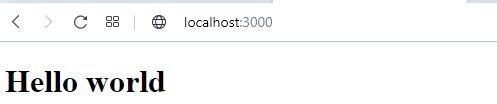
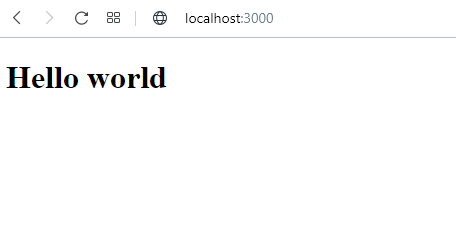
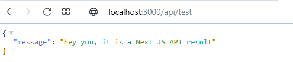
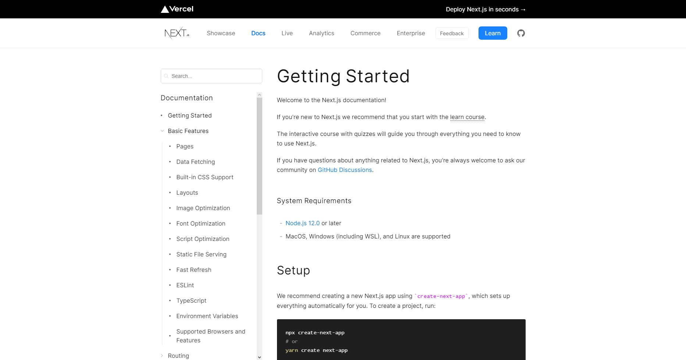

# Introduction to Next JS

By [Dragon Nomada](dragonnomada.medium.com)

## What is Next JS?

A framework develop by [Vercel](https://vercel.com) based on modular, visual and functional components.

> Visit [https://nextjs.org](https://nextjs.org)

## Introduction

You can build complete projects (fullstack) with a **Backend** based on [Node JS](https://nodejs.org) and a **Frontend** based on [React JS](https://reactjs.org).

Follow this tutorial to start using [Next JS](https://nextjs.org).

## Project structure

A Next JS project is composed by a set of files and folders describe in depth in the table below.

> Next JS Project File Architecture

```text
+ /
| + .next
| + node_modules
| + pages
| | + api
| | | <api controller>.js
| | <page controller>.js
| | index.js
| | _app.js
| | 404.js
| package.json
```

File | Description
--- | ---
`.next` | This folder contains metada used by the framework
`node_modules` | This folder contains third party modules installed by `npm install <module name>`
`pages` | This folder contains all the **views/pages** and **apis/controllers**
`api` | This folder containes all **apis/controllers**
`<api controller>.js` | Each *API* is handled by a javascript file or module. A file represents the route for the api. For example, the path `pages/api/test.js` handled the HTTP request for `http://localhost:3000/api/test`.
`<page controller>.js` | Each *VIEW* or *PAGE* is a React Component, handled by a javascript file or module. A file represents the route for the view. For example, the path `pages/about.js` handled the HTTP request for `http://localhost:3000/about` and show the view generated by the React Component exposed in the `about.js` file.
`index.js` | Is the main file used to show `http://localhost:3000/`.
`_app.js` | Is a optional file to configure globally all the components (views/pages).
`404.js` | Is a optional file to show the HTTP `404` error.
`package.json` | Is the file that describes the project, exposing the project's name, version, modules dependencies, and so.

## Tutorial

To create and run a new project, follow this steps.

> 1. Install Node JS

[Download Node JS here](https://nodejs.org/en/download/)



> 2. Verify your Node JS version

```bash
node -v

--- terminal output ---

v14.17.2
```

```bash
npm -v

--- terminal output ---

6.14.13
```

```bash
npx -v

--- terminal output --- 

6.14.13
```

> 3. Create a project folder

```bash
mkdir <path>/<project name>

--- example ---

cd ~/Desktop
mkdir super-app
```

> 4. Move to the project folder and init a package.json

```bash
cd <path>/<project name>
npm init -y

--- example ---

cd ~/Desktop/super-app
npm init -y

--- terminal output ---

Wrote to ~/Desktop/super-app/package.json:

{
  "name": "super-app",
  "version": "1.0.0",
  "description": "",
  "main": "index.js",
  "scripts": {
    "test": "echo \"Error: no test specified\" && exit 1"
  },
  "keywords": [],
  "author": "",
  "license": "ISC"
}
```

> 5. Install the `next` and `react` modules

```bash
npm install --save next react react-dom

--- terminal output ---

# ... some warnings
npm WARN super-app@1.0.0 No description
npm WARN super-app@1.0.0 No repository field.

+ next@11.1.0
+ react@17.0.2
+ react-dom@17.0.2
added 266 packages from 227 contributors and audited 267 packages in 62.678s

46 packages are looking for funding
  run `npm fund` for details

found 0 vulnerabilities

```

> 6. Create the `pages` folder

```bash
mkdir pages
mkdir pages/api

--- project ---

.
├── package-lock.json
├── package.json
└── pages
    └── api
```

> 7. Create the `index.js` (`pages/index.js`)

```jsx
// pages/index.js
import React from "react"

export default function App() {
    return <h1>Hello world</h1>
}
```

> 8. Start the server

* **Note:** Press `ctrl+c` to stop the server.

```bash
npx next dev

--- terminal output ---

ready - started server on 0.0.0.0:3000, url: http://localhost:3000
info  - Using webpack 5. Reason: Enabled by default https://nextjs.org/docs/messages/webpack5
```

> 9. Visit [http://localhost:3000](http://localhost:3000)



> 10. Create a test api (`pages/api/test.js`)

```js
// pages/api/test.js

// Define a handler function (http request like as express middleware)
function apiTestController(request, response) {
    // request - object can access the http request (headers input, data income)
    // response - object can access the http response (headers output, data outcome)

    // Fake result data (JSON output)
    const result = {
        message: "hey you, it is a Next JS API result"
    }

    // Send the result as the http response
    response.send(result)
}

// Export the handler function
module.exports = apiTestController;
```

> 11. Restart the server

```bash
# Press [ctrl + c] if the server is currently running
npx next dev
```

> 12. Visit [http://localhost:3000/api/test](http://localhost:3000/api/test)



## Next Steps

Well, now you are ready to work  with Next JS. You can create amazing APIs and Views.

Try to learn more in the official site.

[https://nextjs.org/docs](https://nextjs.org/docs)



If you need a personal master class [Contact Us](dragonnomada123@gmail.com).
