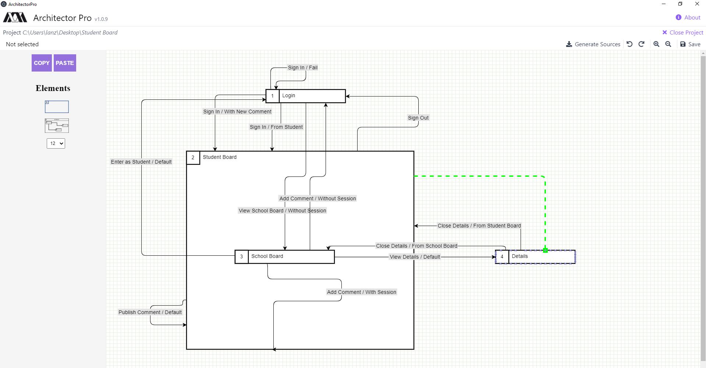

# School Board Project - Tutorial Step by Step

## Introduction

In the next document you can follow step by step the process to build this project. The first step is design the diagram in the Architector Pro Editor, following by generate the source codes and finally setup the *views* and *apis*.

## 1. Create The Project Diagram

> Open Architector Pro and design the next diagram

* **Note:** Be careful with the name of the connectors (`<action>/<condition>`).
