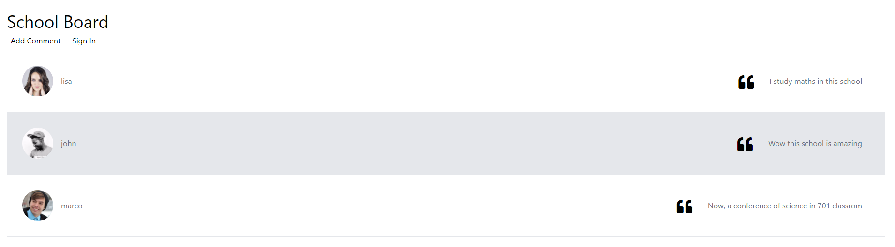

# School Board Project - Tutorial Step by Step

## Introduction

In the next document you can follow step by step the process to build this project. The first step is design the diagram in the Architector Pro Editor, following by generate the source codes and finally setup the *views* and *apis*.

## 1. Create The Project Diagram

> Open Architector Pro and design the next diagram


* **Note:** Be careful with the name of the connectors (`<action>/<condition>`).

## 2. Generate the source code

> In Architector Pro first `Save` the diagram and then `Generate Sources`


## 3. Open the `Source Code Project` in Visual Code

> In Architector Pro open the project folder by clicking the path


> In Explorer do secondary click and open the src folder in Visual Code


* **Note:** If you don't have install the [Visual Studio Code](https://code.visualstudio.com), download it from [https://code.visualstudio.com](https://code.visualstudio.com)

## 4. Inspect the project structure

> In Visual Code expand all folders and check each file


## 5. Test the project

**IMPORTANT:** Check the [Quick Start](./readme.md#quick-start) to run the project.

> Install the dependencies

```bash
npm install
```

> Run the project

```bash
npm run dev
```

* **Note:** If you need stop the project press `CTRL+C`.

> Visit [http://localhost:3000](http://localhost:3000)

## 6. Setup `Login` as the main React Component

> Into `pages/index.js` bind the `Login` component

```jsx
// src/pages/index.js

import Login from "./views/Login";

export default function App() {
    return (
        <Login />
    );
}
```

> **Memo:** Test the project with `npm run dev` and visit [http://localhost:3000](http://localhost:3000)

## 7. Design the `Login` Component

> Remove the comments and clean the code

```jsx
import { useState } from "react";

import useAction from "./useAction";
import useInfo from "./useInfo";
import useSession from "./useSession";

export default function Login() {
    const info = useInfo();

    const [result, session] = useSession();

    const { signIn, viewSchoolBoard } = useAction();

    // TODO: View here
}
```

**IMPORTANT:** We use [Tailwind CSS](https://tailwindcss.com) to adjust the design through `CSS-Classes` like `p-8` equivalent to the rule `{ padding: 2rem; }`. The most important and difficult code is undestand [Flexbox System](https://tailwindcss.com/docs/flex-direction), learn and try to understand all the basics about it.

> Minimap of TailwindCSS

Class | Description
--- | ---
`w-screen` | Fix the width to the screen
`h-screen` | Fix the height to the screen
`flex` | Creates a flexbox container (it can expand itself and the inner elements)
`flex-col` | Display the inner elements like a column (vertical flow direction)
`justify-center` | In `flex-col` mode align the elements to the center in the horizontal axis (tansversal axis)
`items-center` | In `flex-col` mode align the elements to the center in the vertical axis (primary axis)
`w-1/3` | Fix the width to the 33.333% of the parent's width
`border` | Draw a border box
`p-<SIZE>` | Put a inner margin with `<SIZE> units` distance
`rounded-lg` | Round the corners with a `lg size` (big radius rounded)

> Design the View

```js
export default function Login() {
    // ...(useAction and useSession)

    const [username, setUsername] = useState("");
    const [password, setPassword] = useState("");

    return (
        <div className="w-screen h-screen flex flex-col justify-center items-center">
            <div className="w-1/3 border p-8 rounded-lg">
                {/* TITLE */}
                {/* SUBTITLE */}
                <div className="p-4">
                    {/* INPUT username */}
                    {/* INPUT password */}
                    {/* ERROR TEXT result?.error */}
                    {/* COMMENT TEXT result?.comment */}
                </div>
                {/* BUTTON Enter to Student's Board */}
            </div>
            <div className="p-8">
                {/* BUTTON View School Board */}
            </div>
        </div>
    );
}
```

* **Note:** Create two states, the `username` and `password` states, using `useState(initialValue)` [React's Hook](https://reactjs.org/docs/hooks-state.html). Bind this states in the View (inside the `<input>` controls).

> Design the `{/* TITLE */}`

```jsx
<div className="flex items-center pb-4">
    <span className="pr-4"><i className="fas fa-table fa-2x"></i></span>
    <span className="text-4xl">School Board</span>
</div>
```

Class | Description
--- | ---
`items-center` | In `flex-row` mode align the elements to the center in the horizontal axis (transversal axis)
`pb-<SIZE>` | Inner bottom margin
`pr-<SIZE>` | Inner right margin
`fas fa-table` | [Fontawesome `Table` Icon](https://fontawesome.com/v5.15/icons/table?style=solid)
`fa-2x` | 2x times sized icon

> Design the `{/* SUBTITLE */}`

```jsx
<div className="pb-4">
    <span className="text-3xl text-purple-600">Sign In</span>
</div>
```

Class | Description
--- | ---
`text-3xl` | Text with fontsize 3x sized
`text-purple-600` | Text color purple

> Design the `{/* INPUT username */}`

```jsx
<div className="py-1">
    <input
        className="w-full border-b-2 focus:outline-none focus:border-purple-500 p-1"
        placeholder="Username"
        value={username}
        onChange={event => setUsername(event.target.value)}
    />
</div>
```

Class | Description
--- | ---
`py-1` | Inner margin vertical
`w-full` | 100% width
`border-b-2` | Border bottom `2 units`
`focus:outline-none` | Removes outline to input control on focus
`focus:outline-none` | Put border color purple on focus

* **Note:** `value={username}` binds the value of the `<input>` control to the `username` state. When the `<input>` changes use `onChange={event => setUsername(event.target.value)}` to update the `username` state with the value of the `event.target.value` (the current `<input>` value).

> Design the `{/* INPUT password */}`

```jsx
<div className="py-1">
    <input
        className="w-full border-b-2 focus:outline-none focus:border-purple-500 p-1"
        type="password"
        placeholder="password"
        value={password}
        onChange={event => setPassword(event.target.value)}
    />
</div>
```

> Design the `{/* ERROR TEXT result?.error */}`

```jsx
{
    result?.error ? (
        <div className="py-2">
            <span className="text-sm text-red-500">* {result.error}</span>
        </div>
    ) : null
}
```

Class | Description
--- | ---
`text-sm` | Small text
`text-red-500` | Text color red in `500` intensity

* **Note:** Use `result?.error ? <VIEW> : null` to show the `<VIEW>` if the `result` exists and `error` contains some *truthy*. Use `{result.error}` to put the error as content of the span (concats with "* " text).

> Design the `{/* COMMENT TEXT result?.comment */}`

```jsx
{
    result?.comment ? (
        <div className="py-2">
            <span className="text-sm text-purple-500">Sign in to publish your comment: </span>
            <span className="text-sm text-purple-500 font-bold">{result.comment}</span>
        </div>
    ) : null
}
```

> Design the `{/* BUTTON Enter to Student's Board */}`

```jsx
<div className="flex justify-center">
    <button
        className="bg-purple-500 hover:bg-purple-700 text-white px-2 py-1 rounded"
        onClick={() => {
            
            signIn({
                username,
                password,
                comment: result?.comment
            });

        }}
    >Enter to Student's Board</button>
</div>
```

* **Note:** When button is clicking call the action `signIn(...)` with `{ username, password, comment }` object as the api's input. Send the comment as `result?.comment` if exists, else send `null` as comment.

Class | Description
--- | ---
`justify-center` | In `flex-row` mode align the elements to the center in the vertical axis (primary axis)
`bg-purple-500` | Background color purple
`hover:bg-purple-700` | Background color dark purple on mouse hover
`rounded` | Round corners

> Design the `{/* BUTTON View School Board */}`

```jsx
<button
    className="bg-red-500 hover:bg-red-700 text-white px-2 py-1 rounded text-xl"
    onClick={() => {
        viewSchoolBoard();
    }}
>View School Board</button>
```

* **Note:** Call the `viewSchoolBoard()` action when the button is clicked.

> Check for the results


## 8. Design the `School Board` Component

> Design the `School Board` Component

```jsx
import React from "react";

import useAction from "./useAction";
import useInfo from "./useInfo";
import useSession from "./useSession";

export default function SchoolBoard() {
    const [result, session] = useSession();

    const { enterAsStudent, addComment } = useAction();

    return (
        <div className="xw-1/2 flex flex-col p-8 xbg-red-500">
            <div>
                <span className="text-4xl">School Board</span>
            </div>
            <div className="flex">
                <div className="pr-4 p-2">
                    <button onClick={() => {
                        const comment = prompt("Write your comment:");

                        if (comment) {
                            addComment({ comment, username: result?.username });
                        }
                    }}>Add Comment</button>
                </div>
                <div className="p-2">
                    <button onClick={() => enterAsStudent()}>Sign In</button>
                </div>
            </div>
            <div className="flex flex-col">
                {(!result || result.comments.length === 0) ? (
                    <div className="flex p-8">
                        <span className="text-gray-500 italic">Not comments</span>
                    </div>
                ) : null}
                {result ? result.comments.map(comment => {
                    return (
                        <StudentComment
                            key={comment._id}
                            comment={comment}
                            username={result?.username}
                        />
                    );
                }) : null}
            </div>
        </div>
    );
}

// TODO: Design the <StudentComment> component
```

> **NOTE:** Get a new comment from the *prompt* and call the action `addComment`

```jsx
<button onClick={() => {
    const comment = prompt("Write your comment:");

    if (comment) {
        addComment({ comment, username: result?.username });
    }
}}>Add Comment</button>
```

> **NOTE:** Call the `enterAsStudent` action by clicking the button

```jsx
<button onClick={() => enterAsStudent()}>Sign In</button>
```

> **NOTE:** Map each comment as `<StudentComment>`

```jsx
result.comments.map(comment => {
    return (
        <StudentComment
            key={comment._id}
            comment={comment}
            username={result?.username}
        />
    );
})
```

> Design the `<StudentComment>` component

```jsx
function StudentComment({ username, comment }) {
    const { viewDetails } = useAction();

    return (
        <div 
            className="flex items-center border-b p-4 hover:bg-gray-200 cursor-pointer"
            onClick={() => {
                viewDetails({
                    username,
                    comment
                });
            }}
        >
            <div className="flex items-center pr-16">
                <div className="p-4">
                    
                </div>
                <div>
                    <span className="text-gray-500">{comment.username}</span>
                </div>
            </div>
            <div className="flex-grow flex justify-end items-end">
                <div>
                    <span><i className="fas fa-quote-left fa-2x"></i></span>
                </div>
                <div className="text-gray-500 px-8 py-2">
                    <span>{comment.comment}</span>
                </div>
            </div>
        </div>
    );
}
```

> **NOTE:** call the `viewDetails` action by clicking all the comment row

```jsx
<div 
    className="flex items-center border-b p-4 hover:bg-gray-200 cursor-pointer"
    onClick={() => {
        viewDetails({
            username,
            comment
        });
    }}
>
```

> **NOTE:** Display the comment username

```jsx
<div>
    <span className="text-gray-500">{comment.username}</span>
</div>
```

> **NOTE:** Display the comment content

```jsx
<div className="text-gray-500 px-8 py-2">
    <span>{comment.comment}</span>
</div>
```

> Check for the results



## 9. Design the `Details` Component

> Design the `Details` Component

```jsx
import React from "react";

import useAction from "./useAction";
import useSession from "./useSession";

export default function Details() {
    const [result, session] = useSession();

    const { closeDetails } = useAction();

    return (
        <div className="w-screen h-screen flex justify-center items-center">
            <div className="flex flex-col items-center border rounded-lg p-4">
                <div className="flex items-center pr-16">
                    <div className="p-4">
                        
                    </div>
                    <div>
                        <span className="text-gray-500">{result?.comment.username}</span>
                    </div>
                </div>
                <div className="flex-grow flex">
                    <div>
                        <span><i className="fas fa-quote-left fa-2x"></i></span>
                    </div>
                    <div className="text-gray-500 px-8 py-2">
                        <span>{result?.comment.comment}</span>
                    </div>
                </div>
                <div className="text-gray-500 px-8 py-2">
                    <span>{new Date(result?.comment.at).toLocaleString()}</span>
                </div>
                <div className="w-full flex justify-center border-t py-2">
                    <button
                        className="bg-purple-500 text-white py-1 px-2 rounded"
                        onClick={() => {
                            closeDetails({
                                username: result?.username
                            });
                        }}
                    >
                        Go Back
                    </button>
                </div>
            </div>
        </div>
    );
}
```

> **NOTE:** Draw the comment user's picture

```jsx

```

> **NOTE:** Call the `closeDetails` action by clicking the `Return` button.

```jsx
<button
    className="bg-purple-500 text-white py-1 px-2 rounded"
    onClick={() => {
        closeDetails({
            username: result?.username
        });
    }}
>
    Go Back
</button>
```

> Check for the results


## 10. Design the `StudentBoard` Component

> Design the `StudentBoard` Component

```jsx
import React, { useState, useEffect } from "react";

import useAction from "./useAction";
import useSession from "./useSession";

import SchoolBoard from "../SchoolBoard";

export default function StudentBoard() {

    const [result, session] = useSession();

    const { signOut, publishComment } = useAction();

    const [isCommentModalClosed, setIsCommentModalClosed] = useState(false);

    useEffect(() => {
        setIsCommentModalClosed(false);
    }, [session]);

    return (
        <div className="flex flex-col xbg-gray-200">
            <div className="xw-1/2 flex justify-between items-center p-2 border-b px-8 xbg-blue-500">
                <div>
                    <span className="text-2xl">Student's Board</span>
                </div>
                <div className="flex-grow flex justify-between items-center px-8">
                    <div className="flex items-center px-4">
                        <div className="px-4">
                            
                        </div>
                        <div className="flex flex-col px-4">
                            <span className="text-gray-700">Welcome</span>
                            <span className="text-gray-500">{result?.username}</span>
                        </div>
                    </div>
                    <div className="px-8">
                        <button
                            className="text-purple-500"
                            onClick={() => signOut()}
                        >Sign Out</button>
                    </div>
                </div>
            </div>
            {
                (result?.comment && !isCommentModalClosed) ? (
                    <div className="w-screen h-screen absolute left-0 top-0 flex justify-center items-center">
                        <div className="bg-white z-10 p-8 border">
                            <div>
                                <span>Do you publish this comment?</span>
                            </div>
                            <div className="flex items-center py-4">
                                <div>
                                    <span><i className="fas fa-quote-left fa-2x"></i></span>
                                </div>
                                <div className="px-4">
                                    <span className="text-xl">{result.comment}</span>
                                </div>
                            </div>
                            <div className="flex justify-between">
                                <button className="text-red-500" onClick={() => {
                                    setIsCommentModalClosed(true);
                                }}>No, Dismiss</button>
                                <button className="text-green-500" onClick={() => {
                                    publishComment({ comment: result.comment, username: result.username });
                                }}>Yes, Publish</button>
                            </div>
                        </div>
                        <div className="w-screen h-screen flex bg-gray-200 opacity-50 absolute left-0 top-0"></div>
                    </div>
                ) : null
            }
            <SchoolBoard />
        </div>
    );
}
```

> **NOTE:** Creates a open modal state. Check when session will change and update the modal state.

```jsx
const [isCommentModalClosed, setIsCommentModalClosed] = useState(false);

useEffect(() => {
    setIsCommentModalClosed(false);
}, [session]);
```

> **NOTE:** Dismiss or publish the comment. Call the `publishComment` action if the user accepts the modal.

```jsx
<div className="flex justify-between">
    <button className="text-red-500" onClick={() => {
        setIsCommentModalClosed(true);
    }}>No, Dismiss</button>
    <button className="text-green-500" onClick={() => {
        publishComment({ comment: result.comment, username: result.username });
    }}>Yes, Publish</button>
</div>
```

> Check for the results


