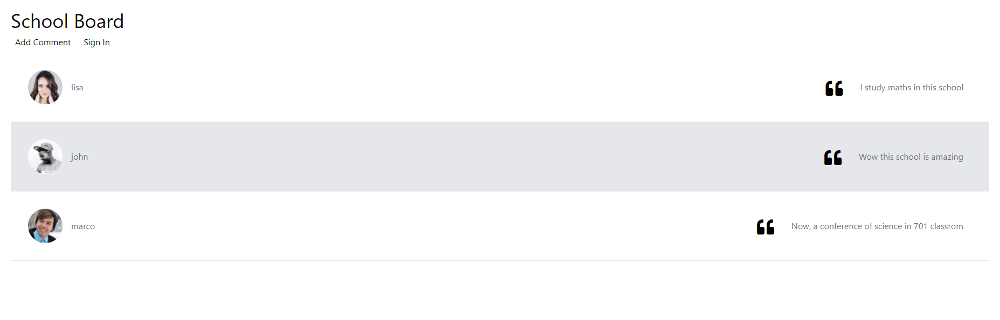

# School Board Project

## Introduction

The [School Board Project](https://github.com/dragonnomada/school-board) was built with [Architector Pro](./ArchitectorPro.md) and released to [Next JS](https://nextjs.org) and [React JS](https://reactjs.org).



## Video Tutorial

[](https://www.youtube.com/watch?v=FQT_CujDQ-Q)

## Test The Project

You can visit [NOT READY](https://example.com) to see the project working.

## Quick Start

Follow the next steps to run this project.

> Open a terminal inside your work folder

```bash
cd ~/Desktop
```

> Clone the School Board Project repo

```bash
git clone https://github.com/dragonnomada/school-board.git
```

> Go to the folder cloned (`~/Desktop/school-board`)

```bash
cd school-board
```

> Check for all ok

```bash
ls

-- Terminal output --

diagram.svg  diagram.xml  docs  src
```

* **Note:** In Windows use the command `dir` instead of `ls`

> Change to `src` folder (`~/Desktop/school-board/src`)

```bash
cd src
```

> Install all dependencies

```bash
npm install
```

> Run the project

```bash
npm run dev

-- Terminal output --

> school-board@1.0.0 dev
> next dev

ready - started server on 0.0.0.0:3000, url: http://localhost:3000
```

> Open the browser and go to [http://localhost:3000](http://localhost:3000)

* Try to use some `user` and `pasword` in the sign in process.

User | Password
--- | ---
**lisa** | simpson
**john** | doe
**marco** | polo

## Learn to use Architector Pro, React JS or Next JS

If you never use Architector Pro, Next JS or React JS then complete these tutorials.

[Introduction to React JS](./ReactJS.md)

[Introduction to Next JS](./NextJS.md)

[Introduction to Architector Pro](./ArchitectorPro.md)

## Tutorial

Follow the next tutorial to understand how the project was built.

[School Board - Tutorial Step by Step](./Tutorial.md)

## Software Architecture

Open this document to understand in depth the *Project's Software Architecture*.

[School Board - Project Architecture](./Architecture.md)

## Documentation

* [Introduction to React JS](./ReactJS.md)

* [Introduction to Next JS](./NextJS.md)

* [Introduction to Architector Pro](./ArchitectorPro.md)

* [School Board - Tutorial Step by Step](./Tutorial.md)

* [School Board - Project Architecture](./Architecture.md)

* [School Board - The Login Guide](./Login-Architecture.md)

* [School Board - The Login View](./Login-View.md)

* [School Board - The Login API](./Login-API.md)

* [School Board - The Student Board Guide](./StudentBoard-Architecture.md)

* [School Board - The Student Board View](./StudentBoard-View.md)

* [School Board - The Student Board API](./StudentBoard-API.md)

* [School Board - The School Board Guide](./SchoolBoard-Architecture.md)

* [School Board - The School Board View](./SchoolBoard-View.md)

* [School Board - The School Board API](./SchoolBoard-API.md)

* [School Board - The Details Guide](./Details-Architecture.md)

* [School Board - The Details View](./Details-View.md)

* [School Board - The Details API](./Details-API.md)

## About

### Project Leaders

[PhD Jorge Cervantes Ojeda](mailto:jorge.cervantes.ojeda@gmail.com)

[PhD María del Carmen Gómez Fuentes](mailto:mcgomezfuentes@netscape.net)

### Main Developer

[Alan Badillo Salas](mailto:dragonnomada123@gmail.com)

### Developers

Rodrigo Iván Del Moral Martínez

Esmeralda Pedraza Vazquez

Ariadna Rivero Rodríguez
